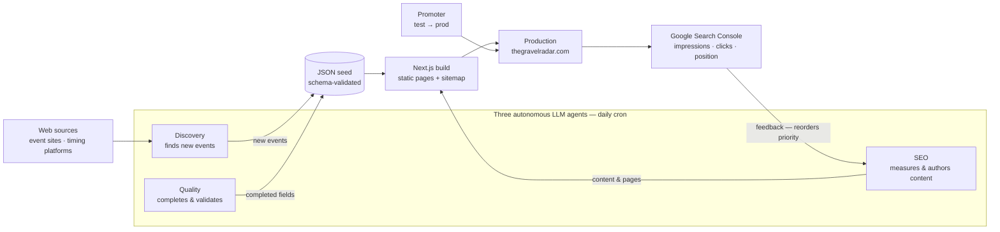

# GravelRadar — Autonomous Multi-Agent SEO & Data Platform

**A production system of three autonomous LLM agents that discover, validate and publish gravel cycling events — driven by a closed-loop SEO engine targeting 100 visits/day.**

🟢 **Live:** [thegravelradar.com](https://thegravelradar.com)

---

## The problem

A global directory of gravel races needs two things that don't scale manually:

1. **Fresh, accurate event data** — hundreds of races across dozens of countries, each with dates, routes, photos and registration details that change every season.
2. **Organic traffic** — thousands of long-tail queries ("Hegau Gravel Race 2026", "best gravel races in Spain") that a new domain can't win with a single generic page.

The answer: **agents that do both, on a schedule, with a feedback loop.**

## The architecture



Three agents + one promoter run daily on `cron`, coordinated through shared state files. The **SEO agent closes the loop**: it measures Search Console, prioritizes by traffic potential, acts, verifies, and updates the roadmap — a genuine *measure → prioritize → act → verify* cycle, not a one-shot pipeline.

## The agents

| Agent | Schedule | Model | Responsibility |
|---|---|---|---|
| **Discovery** | daily | `deepseek-v4-flash` | Search the web exhaustively, extract new events (name, date, routes, photos), write to the JSON store |
| **Quality** | daily | `deepseek-v4-flash` | Complete existing events to a "gold standard" — fill every field, re-derive from official sources, fix fabricated/wrong data |
| **SEO** | daily | `deepseek-v4-pro` | Run the traffic loop: measure → prioritize → author content (country/region/blog pages) → verify → update roadmap |
| **Promoter** | daily | *(no LLM)* | `rsync` test → production, rebuild, restart — gated on quality + discovery having run |

Full agent designs (missions, rules, procedures, pitfalls) live in [`agents/`](agents/).

## The agentic loop

```
measure (Search Console + PageSpeed)
  → prioritize (by traffic potential: commercial-intent → authority → informational)
  → act (1-2 actions)
  → verify (build + HTTP 200)
  → update state (roadmap + metrics)
```

Two layers drive priority: a **proactive roadmap** (what to build — country pages, blog, regions, technical) and **reactive Search Console data** (what's actually ranking — position 4–15, CTR problems). The north-star metric is **visits/day**.

## Results (early, site launched Aug 2026)

- **680+ events** tracked across **30 countries** (94% of the catalog's country coverage)
- **30 country pages** + **11 region pages** + blog, all with FAQ/Event structured data
- First Search Console data within days of indexation: impressions and clicks live
- PageSpeed on the money pages: **62 → 96** (LCP 8.0s → 2.6s) from a single logo optimization
- **~6× cost reduction** through model tiering (flash vs pro) + off-peak scheduling

## Tech stack

`Next.js` · `TypeScript` · `Tailwind` · `Zod` · `DeepSeek (flash/pro)` · `Google Search Console API` · `PageSpeed Insights API` · `Playwright` · `systemd` · `cron` · `rsync`

## Repository layout

```
agents/    — the three agent designs (discovery, quality, SEO)
scripts/   — reusable tooling: Search Console reporter, PageSpeed auditor, promoter
web/       — representative code: domain model (Zod), SEO metadata builders, view-models
docs/      — architecture deep-dive
```

## What's deliberately NOT here

This is a **showcase**, not the production repository. Excluded on purpose:

- **The event dataset** (`data/seed/*.json`) — it's the product's moat
- **The SEO content** (country/region/blog copy) — the competitive advantage
- **Credentials** — service account, API keys, tokens (all redacted above)

The code that *operates* on the data is here; the data itself stays private.
